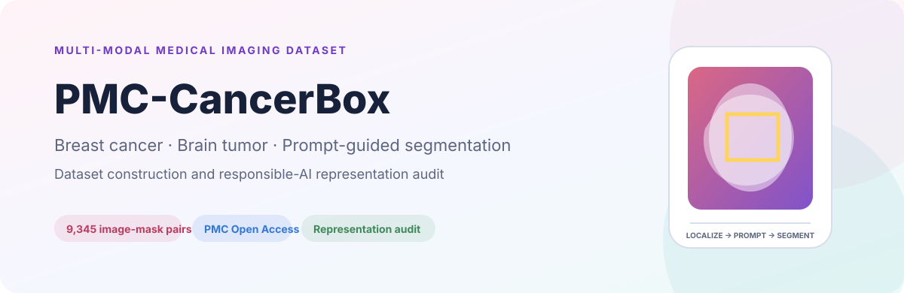
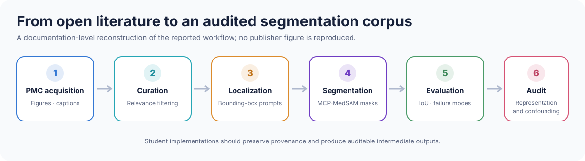

<p align="center">
  
</p>

<p align="center">
  
  
  
  <a href="LICENSE"></a>
</p>

# PMC-CancerBox

**A Multi-Modal Breast Cancer and Brain Tumor Segmentation Dataset with a
Responsible-AI Representation Audit**

PMC-CancerBox is a scientific-literature-derived dataset and evaluation
framework for prompt-guided medical image segmentation. It contains 9,345
image-mask pairs assembled from open-access PubMed Central figures related to
breast cancer and brain tumors.

> The central finding is that localization—not mask refinement—is the main
> bottleneck: text-grounded prompts substantially outperform whole-image
> fallback prompts.

## Repository status

This repository is currently a **documentation and student-development
workspace**.

- The paper is at publication-proof stage.
- The final DOI and complete author metadata are not yet available in the
  supplied proof.
- Dataset access details will be added after the release location is finalized.
- The [`code/`](code/) directory intentionally contains **no implementation**.
  It is reserved for supervised student contributions.
- The publisher proof PDF is not distributed here.

## Study at a glance

| Item | Description |
|---|---|
| Source | PubMed Central Open Access scientific articles |
| Records | 9,345 image-mask pairs from 9,319 figure captions |
| Diseases | Breast cancer and brain tumor |
| Main modalities | MR, CT, ultrasound, mammography, microscopy, PET, X-ray |
| Annotation | Bounding-box localization followed by prompt-guided segmentation |
| Segmentation backbone | MCP-MedSAM |
| Training | No model retraining in the reported pipeline |
| Primary metric | Intersection over Union (IoU) |
| Responsible-AI component | Modality, disease, imaging-family, and failure-mode audit |

## Pipeline

<p align="center">
  
</p>

The reported workflow:

1. Harvests image URLs and metadata from PMC Open Access articles.
2. Extracts and stores figures with associated captions.
3. Filters figures for relevance to breast cancer and brain tumors.
4. Generates or records lesion bounding boxes.
5. Uses boxes as prompts for MCP-MedSAM.
6. Collects segmentation masks and calculates IoU.
7. Audits representation, confounding, and pipeline failure modes.

## Key results

### Segmentation

| Evaluation subset | Records | Mean IoU | Median IoU |
|---|---:|---:|---:|
| Text-grounded box available | 3,381 | **0.6332** | **0.6379** |
| Whole-image fallback | 5,798 | 0.4943 | 0.4498 |
| Unknown box provenance | 166 | 0.5640 | 0.5519 |
| **All records** | **9,345** | **0.5458** | **0.5150** |

Text-grounded boxes improve mean IoU by 0.139 over whole-image fallback,
indicating that better localization is the highest-value direction for
improving the pipeline.

### Representation audit

| Finding | Result |
|---|---:|
| MR and CT combined | 84.9% |
| Radiological images | 96.8% |
| Captions containing at least one medical term | 91.95% |
| Records in the heuristic “other” disease category | 48.0% |
| Records flagged as multiple lesions/panels | 88.3% |
| Articles published in 2020 or later | 83.4% of dated articles |

The apparent “multiple lesions” failure is largely a multi-panel publication
figure artifact rather than evidence of multifocal disease.

## Modality profile

| Modality | Records | Corpus share | Mean IoU |
|---|---:|---:|---:|
| MR | 4,077 | 43.6% | 0.4634 |
| CT | 3,861 | 41.3% | 0.5885 |
| Ultrasound | 529 | 5.7% | 0.7233 |
| Mammography | 421 | 4.5% | 0.5752 |
| Microscopy | 298 | 3.2% | 0.7232 |
| PET | 85 | 0.9% | 0.6311 |
| X-ray | 66 | 0.7% | 0.5800 |

Results for modalities with fewer than 30 records should not be interpreted as
reliable estimates. See [docs/DATA_CARD.md](docs/DATA_CARD.md) for the full
dataset description.

## Responsible use

PMC-CancerBox is a research dataset, not a clinical product.

- Patient demographics are absent from PMC figure metadata; demographic
  fairness analysis is therefore out of scope for the current release.
- Published figures are selected for illustrative clarity and do not represent
  consecutive clinical cohorts.
- Disease labels derived from caption keywords are weak labels, not clinical
  ground truth.
- Modality and disease are confounded.
- Aggregate performance must not be interpreted as evidence of deployment
  readiness.

Read the detailed [responsible-AI audit](docs/RESPONSIBLE_AI_AUDIT.md).

## Student implementation area

The [`code/`](code/) directory is intentionally empty of source code. Students
can implement independent modules for:

- PMC acquisition and metadata normalization;
- figure-type and relevance classification;
- multi-panel figure decomposition;
- caption-based disease classification;
- text-grounded bounding-box generation;
- MCP-MedSAM, Swift-MedSAM, and MedSAM evaluation;
- reproducible metrics and error analysis; and
- automated representation audits.

Suggested projects and acceptance criteria are provided in
[docs/STUDENT_PROJECTS.md](docs/STUDENT_PROJECTS.md).

## Repository structure

```text
pmc-cancerbox/
├── README.md
├── CITATION.cff
├── LICENSE
├── CONTRIBUTING.md
├── assets/
│   ├── repository-banner.svg
│   └── pipeline-overview.svg
├── code/
│   └── README.md
├── data/
│   └── README.md
├── docs/
│   ├── DATA_CARD.md
│   ├── RESPONSIBLE_AI_AUDIT.md
│   ├── STUDENT_PROJECTS.md
│   └── REFERENCES.md
└── .github/
    ├── ISSUE_TEMPLATE/
    └── pull_request_template.md
```

## Citation

The final bibliographic record is pending publication. A provisional citation
file is provided in [CITATION.cff](CITATION.cff) and should be updated when the
DOI and complete author list are confirmed.

## Copyright

The publication proof, paper figures, and publisher layout are not included.
Original repository documentation and graphics are licensed under
[CC BY 4.0](LICENSE). External papers, data, models, and code retain their own
terms.

